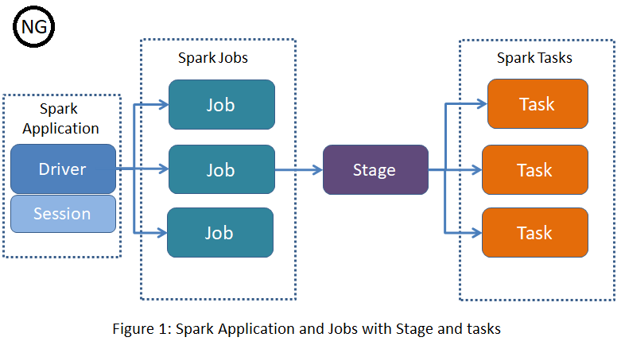

# Spark
Apache Spark is an open-source distributed general-purpose cluster-computing framework. Spark provides an interface for programming entire clusters with implicit data parallelism and fault tolerance. Originally developed at the University of California, Berkeley's AMPLab, the Spark codebase was later donated to the Apache Software Foundation, which has maintained it since.


### Spark Overview
Apache Spark is a unified analytics engine for large-scale data processing. It provides high-level APIs in Java, Scala, Python and R, and an optimized engine that supports general execution graphs. It also supports a rich set of higher-level tools including Spark SQL for SQL and structured data processing, MLlib for machine learning, GraphX for graph processing, and Structured Streaming for incremental computation and stream processing.

## Create the Docker base file 
Dockerfile

## Primary Users 
- Data Scientist 
- Data Engineers


## Spark APIs
- RDDs
- DataFrames
- Datasets

## Popular Spark Use cases   4P's
- Parallel processing across cluster
- Performing adhoc queries for EDA
- Pipelines implementations for data 
- Processig and analyzing graph data and social networks 

# Run the Spark Submit on Kubernetes Cluster
Spark-Submit


## Create a Spark Session
```scala
import org.apache.spark.sql.SparkSession

val spark = SparkSession
  .builder()
  .master("local[1]")
  .appName("Spark App")
  .config("spark.driver.cores", "2")
  .getOrCreate()
  
val df = spark.read("data.json").json(jsonPath)
df.show()

```

## Spark Shell Read a Text File 
```
scala> val readMeDf  = spark.read.text("../README.md")
scala>readMeDf.show(5, false)
```
```
+--------------------------------------------------------------------------------+
|value                                                                           |
+--------------------------------------------------------------------------------+
|# Apache Spark                                                                  |
|                                                                                |
|Spark is a unified analytics engine for large-scale data processing. It provides|
|high-level APIs in Scala, Java, Python, and R, and an optimized engine that     |
|supports general computation graphs for data analysis. It also supports a       |
+--------------------------------------------------------------------------------+
only showing top 5 rows
```


## Spark App Flow 



## Spark Operations
1) Transformations  e.g. orderBy() | groupBy() | join() | filter() | select() 
2) Actions  e.g. show() | count() | take()  | collect() | save() 


### Spark DataFrameReader methods
- spark.read.format("parquet").load("file.parquet")  or spark.read.load("file.parquet")
- spark.read.format("csv").option("inferSchema", "true").option("header", "true").option("mode", "PERMISSIVE").load("file.csv")
- spark.read.format("json").load("file.json")

## Links
- https://github.com/apache/spark
- https://spark.apache.org/downloads.html
- http://livy.incubator.apache.org/get-started/
